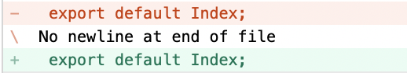

# WaaS WebApp lev2 2주차 comment

## 1. 총평
* hooks 적용을 아주 잘 해주었음, nextJS도 component 분리해놓은 것을 보면 아주 잘 작성한 듯!
    * hooks의 다음 사항에 대해 다시한번 점검해볼 것
        * useState, useEffect가 어떤 역할을 하는지
        * state를 써야하는 이유, 일반 변수는 바뀌면 re-rendering이 안되기 떄문!
        * 이외에도 다양한 lifecycle이 있음

## 2. Feedback
### backend
* package-lock.json은 보통 개발과정에서는 `.gitignore`에 추가함
* `package.json`의 `scripts`에 server start 넣었음
* `body-parser` install 빠져있어서 추가함

### front
* package-lock.json은 보통 개발과정에서는 `.gitignore`에 추가함
* 이번주차까지는 큰 상관이 없지만, typescript로 구성하다보면 pages, components 등의 serve 대상이 되는 파일들을 source의 줄임말인 `src` 폴더에 많이 저장함.
    ```
    ├─── src
    │    ├─── (serve 대상 파일)
    ├─ (config 파일: .gitignore, package.json, .babelrc 등)
    ```
    * 이때 script에서는 아래와 같이 작성
        ```
        "next": "next ./src -p 3000"
        ```
* 보통 code 작성 시 마지막 line은 빈칸 enter로 구성함 (convention)
    * git에서도 endline을 권유함
        
* 중간에 작성해둔 placelistinfo는 component 폴더보다는 다음의 2가지 방법으로 분류함
    * 구성 logic이 view에만 영향을 주는 간단한 요소: class의 method, hooks 내의 function 정의로 해결
    * 구성 logic이 복잡한 경우: FLUX 구조 중 dispatcher로 해결
        * https://haruair.github.io/flux/docs/actions-and-the-dispatcher.html
        * flux 구조에 대해서는 추가적으로 설명, 일단은 아래와 같이 구성
            ```
            ├─── page
            │    ├─── (flux 중 view에 해당)
            ├─── components
            │    ├─── (page에서 분리한 module형 view, flux 중 view에 해당)
            ├─── store
            │    ├─── (flux 중 store에 해당, 보통 redux/MobX의 store가 들어감)
            ├─── dispatcher
            │    ├─── (flux 중 store에 해당)
            ```
    * 지금의 경우 간단한 logic이긴 하지만 분리해보는 측면에서 dispatcher/placelistinfo.js로 분리했음

* JS folder import
    * JS에서 folder를 import하면 `index.js` 파일을 불러와 확인해 줌
        * python의 `__init__.py`와 같다고 생각하면 됨
    * `index.js`에서 다른 file들을 불러옴, 이와 같이 작성하면 외부에서 import할 때는 component 폴더만 import 하면 되기 떄문에 편리함
        * 이후에 component가 20개 이상 넘어가게 되면 위 구조가 필수가 된다고 생각하면 됨

## 3. 추가개념
* flux architecture
    * https://haruair.github.io/flux/docs/actions-and-the-dispatcher.html
    * 한번 link에 방문해 읽어볼 것, flux 구조는 기존의 mvc 구조를 대체하기 위해 등장한 구조
        * MVC 구조? 일반적인 server instance는 mvc 구조를 가져감
        * front의 경우에는 flux 구조도 잘 들어맞지만, 보통은 MVC 구조가 대표적으로 쓰임
        * MVC 구조는 backend에 대해서 아직 교육을 진행하지 않아 잘 모를텐데, 자체 구글링 해보고 곧 MVC 구조에 대해 배우게 될 것임
    * Flux 구조는 아래의 4개 요소로 구성됨
        * Action: 동적인 작동을 위해 특정 행동이 발생하는 순간을 listen하고 있다가 dispatcher에 제공하는 역할을 수행
        * Dispatcher: action으로 event가 전달되면, store의 값을 event에 따라 어떻게 변경할 것인지를 logic으로 정의해놓음
        * Store: 동적으로 보여질 content를 담고 있는 곳, dispatcher에 의해 값이 변경됨
        * View: 화면에 보여지는 내용을 담는 부분, store의 content를 불러와 보여줌
